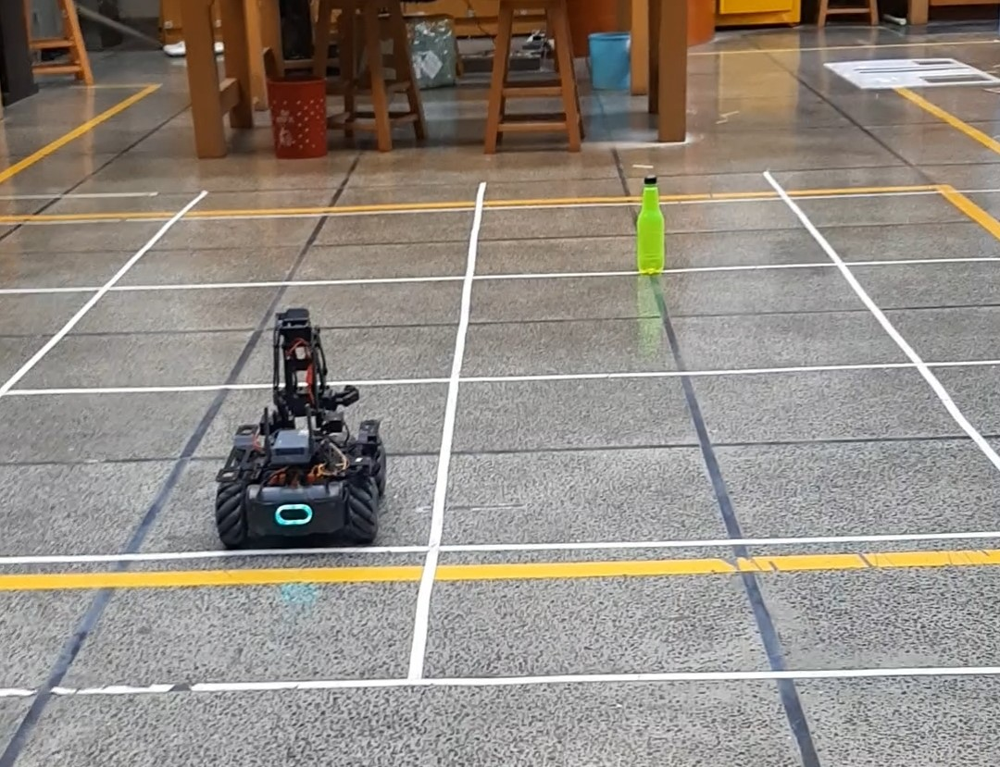
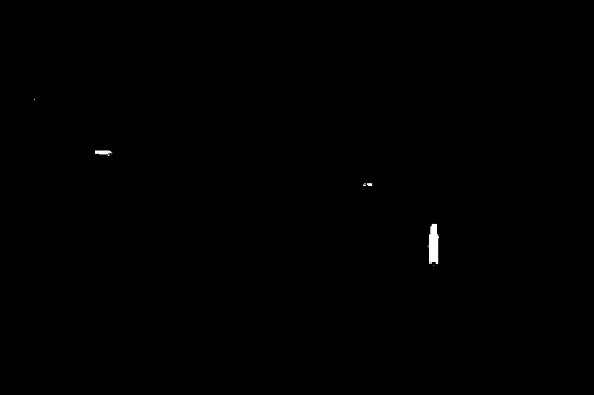

<h1> Masking and Contouring using OpenCV to Pick up an Object </h1>

 

<h2> Overview </h2>
This project uses computer vision and robotics to detect a green bottle, calculate its distance and angle, and then pick up and return the bottle. The key features include:

- Real-time image processing to apply a green mask and isolate the bottle.
- Calculation of the bottle's distance and angle based on the detected object size and camera field of view.
- Precise control of the robot's movements, including chassis rotation and linear motion, to navigate to the bottle's location.
- Coordination of the robotic arm and gripper to grasp and lift the bottle.

<h2> Requirements </h2>

- Robomaster robot with necessary sensors and end-effectors (camera, chassis, gripper, robotic arm)
- OpenCV library for image processing
- Robomaster SDK for robot control

<h2> How it Works </h2>

1. The robot's camera captures a live video feed and processes each frame to detect the green bottle.
2. A green color mask is applied to the image, isolating the bottle and turning everything else black.
3. The size and position of the detected bottle are used to calculate its distance and angle relative to the robot.
4. The robot's chassis is rotated to align with the bottle's angle, and the robot is then driven towards the bottle's location.
5. The robotic arm extends to reach the bottle, and the gripper closes to grasp it.
6. The robot then retracts the arm and drives back to the starting position, where the bottle is released.

<h2> Usage </h2>

1. Connect the Robomaster robot and ensure all necessary components are properly configured.
2. Run the Task2.py script, which will handle the object detection, distance/angle calculation, and robot control.
3. The script will display the processed video feed, showing the green bottle isolated against a black background.
4. The calculated distance and angle to the bottle will be printed in the console.
5. The robot will then navigate to the bottle, pick it up, and return it to the starting position.

<h2> Customization </h2>
The script can be customized to handle different types of objects or scenarios. You can modify the color range for the mask, adjust the camera field of view and focal length, and fine-tune the robot's movement parameters to suit your specific needs.

<h2> Contribution </h2>
If you have any suggestions, bug reports, or improvements for this project, please feel free to open an issue or submit a pull request on the project's GitHub repository.